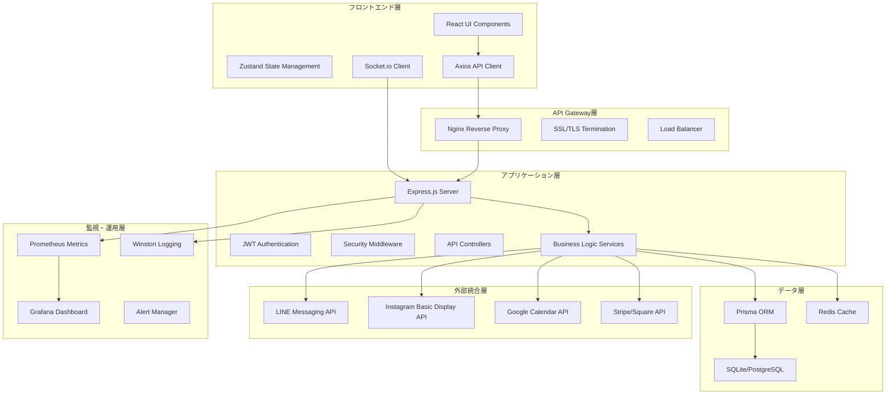
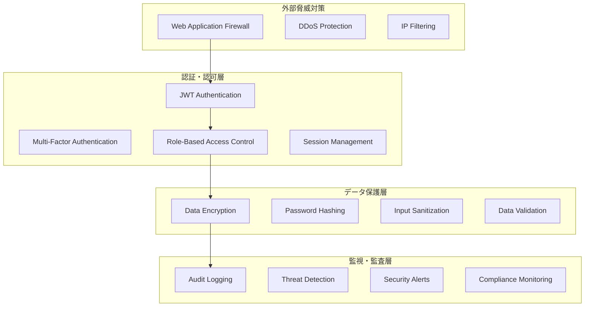

# 美容室管理システム100%完成設計書

## 概要

本設計書は、現在95%完成している美容室統合管理システムを確実に100%まで到達させるための包括的な技術設計を定義します。要件定義書で定義された10の主要要件を実現するための具体的なアーキテクチャ、実装方針、技術選定を詳述します。

## アーキテクチャ

### 全体システムアーキテクチャ



### セキュリティアーキテクチャ



## コンポーネントと インターフェース

### 1. 品質保証システム

#### TypeScript・ESLint完全対応モジュール
```typescript
// src/utils/quality-assurance.ts
interface QualityMetrics {
  typeScriptErrors: number;
  eslintWarnings: number;
  testCoverage: number;
  codeComplexity: number;
}

interface QualityGate {
  checkTypeScriptCompliance(): Promise<boolean>;
  validateESLintRules(): Promise<boolean>;
  measureTestCoverage(): Promise<number>;
  analyzeCodeComplexity(): Promise<number>;
}
```

#### テストフレームワーク統合
```typescript
// src/test/test-framework.ts
interface TestSuite {
  unitTests: UnitTestConfig;
  integrationTests: IntegrationTestConfig;
  e2eTests: E2ETestConfig;
  performanceTests: PerformanceTestConfig;
}

interface TestRunner {
  runAllTests(): Promise<TestResults>;
  generateCoverageReport(): Promise<CoverageReport>;
  validatePerformanceMetrics(): Promise<PerformanceMetrics>;
}
```

### 2. フロントエンド統合システム

#### Instance統合コンポーネント
```typescript
// src/components/instances/InstanceIntegration.tsx
interface InstanceProps {
  instanceType: 'menu-ai' | 'smart-booking' | 'realtime-notification' | 'broadcast';
  config: InstanceConfig;
  onStatusChange: (status: InstanceStatus) => void;
}

interface InstanceManager {
  initializeInstance(type: string, config: InstanceConfig): Promise<void>;
  synchronizeInstances(): Promise<void>;
  monitorInstanceHealth(): Promise<HealthStatus>;
}
```

#### リアルタイム通信統合
```typescript
// src/services/realtime-integration.ts
interface RealtimeService {
  establishWebSocketConnection(): Promise<WebSocket>;
  handleRealtimeUpdates(callback: (data: any) => void): void;
  broadcastToAllClients(message: BroadcastMessage): Promise<void>;
  manageConnectionPool(): Promise<void>;
}
```

### 3. セキュリティ・コンプライアンス強化システム

#### 包括的セキュリティモジュール
```typescript
// src/security/comprehensive-security.ts
interface SecurityAudit {
  performVulnerabilityAssessment(): Promise<VulnerabilityReport>;
  conductPenetrationTest(): Promise<PenTestResults>;
  validateGDPRCompliance(): Promise<ComplianceStatus>;
  generateSecurityReport(): Promise<SecurityReport>;
}

interface ThreatDetection {
  monitorSuspiciousActivity(): Promise<void>;
  detectAnomalousPatterns(): Promise<ThreatAlert[]>;
  implementAutoResponse(threat: ThreatType): Promise<void>;
}
```

#### データ暗号化・保護システム
```typescript
// src/security/data-protection.ts
interface DataProtection {
  encryptSensitiveData(data: any): Promise<EncryptedData>;
  decryptSecureData(encryptedData: EncryptedData): Promise<any>;
  implementFieldLevelEncryption(): Promise<void>;
  manageEncryptionKeys(): Promise<KeyManagementStatus>;
}
```

### 4. 運用・監視システム

#### 包括的監視プラットフォーム
```typescript
// src/monitoring/comprehensive-monitoring.ts
interface MonitoringSystem {
  initializePrometheus(): Promise<void>;
  setupGrafanaDashboards(): Promise<void>;
  configureAlertRules(): Promise<void>;
  generateHealthReports(): Promise<HealthReport>;
}

interface MetricsCollector {
  collectSystemMetrics(): Promise<SystemMetrics>;
  trackBusinessMetrics(): Promise<BusinessMetrics>;
  monitorUserExperience(): Promise<UXMetrics>;
  analyzePerformanceTrends(): Promise<TrendAnalysis>;
}
```

#### ログ管理・分析システム
```typescript
// src/logging/log-management.ts
interface LogManagement {
  implementStructuredLogging(): Promise<void>;
  setupLogAggregation(): Promise<void>;
  createLogAnalytics(): Promise<void>;
  configureLogRetention(): Promise<void>;
}
```

### 5. パフォーマンス最適化システム

#### 多層キャッシュ戦略
```typescript
// src/performance/caching-strategy.ts
interface CacheManager {
  implementRedisCache(): Promise<void>;
  setupApplicationCache(): Promise<void>;
  configureDatabaseCache(): Promise<void>;
  optimizeCacheHitRatio(): Promise<void>;
}

interface PerformanceOptimizer {
  optimizeAPIResponses(): Promise<void>;
  implementDatabaseIndexing(): Promise<void>;
  setupConnectionPooling(): Promise<void>;
  enableCompressionMiddleware(): Promise<void>;
}
```

### 6. ドキュメント・保守性システム

#### 自動ドキュメント生成
```typescript
// src/documentation/auto-documentation.ts
interface DocumentationGenerator {
  generateOpenAPISpec(): Promise<OpenAPISpec>;
  createOperationalManual(): Promise<OperationalManual>;
  buildTroubleshootingGuide(): Promise<TroubleshootingGuide>;
  updateAPIDocumentation(): Promise<void>;
}
```

#### CI/CD パイプライン
```typescript
// src/deployment/cicd-pipeline.ts
interface CICDPipeline {
  setupGitHubActions(): Promise<void>;
  configureAutomatedTesting(): Promise<void>;
  implementBlueGreenDeployment(): Promise<void>;
  setupRollbackMechanism(): Promise<void>;
}
```

## データモデル

### 品質管理テーブル
```sql
-- 品質メトリクス管理
CREATE TABLE quality_metrics (
  id INTEGER PRIMARY KEY AUTOINCREMENT,
  tenant_id TEXT NOT NULL,
  metric_type TEXT NOT NULL, -- 'typescript', 'eslint', 'test_coverage', 'performance'
  metric_value REAL NOT NULL,
  threshold_value REAL NOT NULL,
  status TEXT NOT NULL, -- 'pass', 'warning', 'fail'
  measured_at DATETIME DEFAULT CURRENT_TIMESTAMP,
  details TEXT -- JSON形式の詳細情報
);

-- テスト実行履歴
CREATE TABLE test_execution_history (
  id INTEGER PRIMARY KEY AUTOINCREMENT,
  tenant_id TEXT NOT NULL,
  test_suite TEXT NOT NULL, -- 'unit', 'integration', 'e2e', 'performance'
  total_tests INTEGER NOT NULL,
  passed_tests INTEGER NOT NULL,
  failed_tests INTEGER NOT NULL,
  coverage_percentage REAL,
  execution_time INTEGER, -- ミリ秒
  executed_at DATETIME DEFAULT CURRENT_TIMESTAMP,
  results TEXT -- JSON形式のテスト結果
);
```

### セキュリティ監査テーブル
```sql
-- セキュリティ監査ログ
CREATE TABLE security_audit_log (
  id INTEGER PRIMARY KEY AUTOINCREMENT,
  tenant_id TEXT NOT NULL,
  audit_type TEXT NOT NULL, -- 'vulnerability_scan', 'penetration_test', 'compliance_check'
  severity TEXT NOT NULL, -- 'low', 'medium', 'high', 'critical'
  finding_description TEXT NOT NULL,
  remediation_status TEXT NOT NULL, -- 'open', 'in_progress', 'resolved', 'accepted_risk'
  detected_at DATETIME DEFAULT CURRENT_TIMESTAMP,
  resolved_at DATETIME,
  details TEXT -- JSON形式の詳細情報
);

-- 脅威検知履歴
CREATE TABLE threat_detection_log (
  id INTEGER PRIMARY KEY AUTOINCREMENT,
  tenant_id TEXT NOT NULL,
  threat_type TEXT NOT NULL, -- 'brute_force', 'sql_injection', 'xss', 'ddos'
  source_ip TEXT NOT NULL,
  user_agent TEXT,
  request_details TEXT, -- JSON形式
  risk_score INTEGER NOT NULL, -- 1-100
  action_taken TEXT NOT NULL, -- 'blocked', 'monitored', 'alerted'
  detected_at DATETIME DEFAULT CURRENT_TIMESTAMP
);
```

### 監視・メトリクステーブル
```sql
-- システムメトリクス
CREATE TABLE system_metrics (
  id INTEGER PRIMARY KEY AUTOINCREMENT,
  tenant_id TEXT NOT NULL,
  metric_name TEXT NOT NULL, -- 'cpu_usage', 'memory_usage', 'disk_usage', 'response_time'
  metric_value REAL NOT NULL,
  unit TEXT NOT NULL, -- '%', 'MB', 'ms', etc.
  threshold_warning REAL,
  threshold_critical REAL,
  status TEXT NOT NULL, -- 'normal', 'warning', 'critical'
  collected_at DATETIME DEFAULT CURRENT_TIMESTAMP
);

-- パフォーマンス履歴
CREATE TABLE performance_history (
  id INTEGER PRIMARY KEY AUTOINCREMENT,
  tenant_id TEXT NOT NULL,
  endpoint TEXT NOT NULL,
  method TEXT NOT NULL, -- 'GET', 'POST', etc.
  response_time INTEGER NOT NULL, -- ミリ秒
  status_code INTEGER NOT NULL,
  user_id TEXT,
  timestamp DATETIME DEFAULT CURRENT_TIMESTAMP,
  request_size INTEGER, -- バイト
  response_size INTEGER -- バイト
);
```

## エラーハンドリング

### 包括的エラー管理システム
```typescript
// src/errors/comprehensive-error-handling.ts
interface ErrorHandler {
  handleSystemErrors(error: SystemError): Promise<void>;
  handleBusinessLogicErrors(error: BusinessError): Promise<void>;
  handleSecurityErrors(error: SecurityError): Promise<void>;
  handlePerformanceErrors(error: PerformanceError): Promise<void>;
}

interface ErrorRecovery {
  implementAutoRecovery(errorType: ErrorType): Promise<void>;
  executeFailoverProcedure(): Promise<void>;
  performHealthCheck(): Promise<HealthStatus>;
  notifyOperationsTeam(error: CriticalError): Promise<void>;
}
```

### エラー分類・対応マトリックス
```typescript
enum ErrorSeverity {
  LOW = 'low',
  MEDIUM = 'medium',
  HIGH = 'high',
  CRITICAL = 'critical'
}

interface ErrorResponse {
  severity: ErrorSeverity;
  autoRecovery: boolean;
  notificationRequired: boolean;
  escalationPath: string[];
  recoveryProcedure: string;
}
```

## テスト戦略

### 多層テスト戦略
```typescript
// src/test/comprehensive-testing.ts
interface TestStrategy {
  unitTests: {
    framework: 'Jest';
    coverage: 80; // 最低80%
    mocking: 'jest.mock()';
    assertions: 'expect()';
  };
  
  integrationTests: {
    framework: 'Supertest';
    apiTesting: boolean;
    databaseTesting: boolean;
    externalApiMocking: boolean;
  };
  
  e2eTests: {
    framework: 'Playwright';
    browserTesting: boolean;
    mobileResponsive: boolean;
    userJourneyTesting: boolean;
  };
  
  performanceTests: {
    framework: 'Artillery';
    loadTesting: boolean;
    stressTesting: boolean;
    enduranceTesting: boolean;
  };
}
```

### テスト自動化パイプライン
```yaml
# .github/workflows/comprehensive-testing.yml
name: Comprehensive Testing Pipeline
on: [push, pull_request]

jobs:
  quality-gates:
    runs-on: ubuntu-latest
    steps:
      - name: TypeScript Type Check
        run: npm run type-check
      - name: ESLint Code Quality
        run: npm run lint
      - name: Unit Tests with Coverage
        run: npm run test:coverage
      - name: Integration Tests
        run: npm run test:integration
      - name: E2E Tests
        run: npm run test:e2e
      - name: Performance Tests
        run: npm run test:performance
      - name: Security Audit
        run: npm audit --audit-level high
```

## 実装フェーズ

### フェーズ1: 品質保証基盤構築（1週間）
1. TypeScript設定最適化
2. ESLint設定強化
3. Jest テストフレームワーク設定
4. 品質ゲート実装

### フェーズ2: フロントエンド統合完成（2週間）
1. Instance A-D のUI統合
2. リアルタイム通信実装
3. 統一UX/UIデザイン適用
4. レスポンシブデザイン完成

### フェーズ3: セキュリティ・コンプライアンス強化（1週間）
1. セキュリティ監査実施
2. 脆弱性対策実装
3. GDPR対応完成
4. 監査ログ強化

### フェーズ4: 運用・監視システム構築（1週間）
1. Prometheus + Grafana設定
2. アラートシステム構築
3. ログ管理システム実装
4. ヘルスチェック強化

### フェーズ5: パフォーマンス最適化（1週間）
1. キャッシュ戦略実装
2. データベース最適化
3. API応答時間改善
4. 負荷テスト実施

### フェーズ6: ドキュメント・CI/CD完成（1週間）
1. OpenAPI仕様書生成
2. 運用マニュアル作成
3. CI/CDパイプライン構築
4. 自動デプロイメント設定

### フェーズ7: 最終検証・品質保証（1週間）
1. 包括的テスト実行
2. セキュリティテスト実施
3. ユーザー受入テスト
4. 最終品質監査

## 技術選定理由

### 品質保証ツール
- **TypeScript**: 型安全性による品質向上
- **ESLint**: コード品質の統一
- **Jest**: 包括的テストフレームワーク
- **Playwright**: 信頼性の高いE2Eテスト

### 監視・運用ツール
- **Prometheus**: メトリクス収集の業界標準
- **Grafana**: 直感的な可視化ダッシュボード
- **Winston**: 構造化ログの実装
- **Redis**: 高性能キャッシュシステム

### セキュリティツール
- **Helmet.js**: セキュリティヘッダー設定
- **bcryptjs**: パスワードハッシュ化
- **jsonwebtoken**: JWT認証実装
- **speakeasy**: 2FA認証実装

## 成功指標

### 品質指標
- TypeScript エラー: 0件
- ESLint 警告: 0件
- テストカバレッジ: 80%以上
- コード複雑度: 10以下

### パフォーマンス指標
- API応答時間: 95%が100ms以下
- ページ読み込み時間: 2秒以下
- 同時接続数: 1000+ユーザー
- キャッシュヒット率: 90%以上

### セキュリティ指標
- 脆弱性: 0件（高・重要度）
- セキュリティテスト: 100%合格
- コンプライアンス: GDPR完全準拠
- 監査ログ: 100%記録

### 運用指標
- システム可用性: 99.9%以上
- 平均復旧時間: 5分以下
- 監視カバレッジ: 100%
- アラート精度: 95%以上