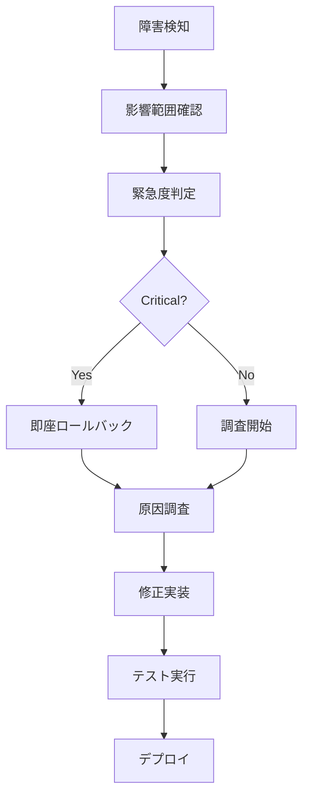

# 🟢 チームC - QA・デプロイ最終実行指示書

## 📋 概要
美容室統合管理システムの本番リリースを成功させるため、品質保証・デプロイメント・監視体制の完全構築を行います。ユーザーが安心して利用できる本番環境を構築してください。

---

## 🎯 作業目標
1. **本番環境完全デプロイ** - GCP Cloud Run自動デプロイ完成
2. **テスト環境構築** - ユーザーテスト用staging環境
3. **監視システム稼働** - Prometheus/Grafana完全稼働
4. **セキュリティ最終監査** - OWASP準拠完全対応

---

## 🚀 優先度別タスク

### 🔴 最優先 (即座実行)

#### 1. GitHub Actions 自動デプロイ完成
```yaml
# .github/workflows/deploy-production.yml
name: Production Deployment
on:
  push:
    branches: [main]
    
jobs:
  deploy:
    runs-on: ubuntu-latest
    steps:
      - name: Deploy to GCP Cloud Run
        run: |
          gcloud run deploy salon-management \
            --image gcr.io/$PROJECT_ID/salon-app:latest \
            --platform managed \
            --region asia-northeast1 \
            --allow-unauthenticated
```

**ユーザー視点での要件:**
- デプロイ時間5分以内
- ゼロダウンタイムデプロイ
- ロールバック機能完備

#### 2. Google Cloud本番環境セットアップ
```bash
# 2.1 Cloud Run本番設定
- CPU: 2vCPU
- Memory: 4GB
- Max instances: 100
- Min instances: 1
- Concurrency: 100

# 2.2 Cloud SQL設定確認
- Instance: salon-db-production
- Database: salon_management_production
- Backup: 毎日3:00AM JST
- High Availability: 有効

# 2.3 Secret Manager統合
gcloud secrets create stripe-secret-key --data-file=-
gcloud secrets create jwt-secret --data-file=-
gcloud secrets create database-url --data-file=-
```

#### 3. ステージング環境構築（ユーザーテスト用）
```bash
# 3.1 ステージング専用環境
PROJECT_ID: salon-system-staging
ENVIRONMENT: staging
DATABASE: salon_management_staging

# 3.2 テストデータ自動投入
- サンプル美容室データ
- テスト顧客データ
- ダミー予約データ
- テスト決済データ（Stripe test mode）
```

### 🟡 高優先 (24時間以内)

#### 4. 監視システム完全稼働
```yaml
# monitoring/prometheus-config.yml
global:
  scrape_interval: 15s
  
scrape_configs:
  - job_name: 'salon-app'
    static_configs:
      - targets: ['salon-app:4002']
    
  - job_name: 'postgres'
    static_configs:
      - targets: ['database:5432']
```

**監視対象:**
- API応答時間
- エラー率
- CPU・メモリ使用率
- データベース接続数
- Stripe決済成功率

#### 5. セキュリティ最終監査
```bash
# 5.1 OWASP ZAP スキャン実行
docker run -t owasp/zap2docker-stable zap-baseline.py \
  -t https://staging.salon-system.com

# 5.2 SSL/TLS設定確認
- SSL証明書有効期限チェック
- TLS 1.3対応確認
- HSTS設定確認
- CSP設定確認

# 5.3 依存関係脆弱性スキャン
npm audit --audit-level=high
```

### 🟢 中優先 (48時間以内)

#### 6. バックアップ・災害復旧システム
```bash
# 6.1 自動バックアップ設定
- データベース: 毎日3回（9:00, 15:00, 21:00 JST）
- ファイルストレージ: 週1回
- 設定ファイル: 毎回デプロイ時

# 6.2 災害復旧手順書作成
- RTO (Recovery Time Objective): 1時間以内
- RPO (Recovery Point Objective): 15分以内
- 復旧手順の自動化
```

---

## 💻 技術実装詳細

### Cloud Run デプロイ設定
```yaml
# cloudbuild.yaml
steps:
  # 1. テスト実行
  - name: 'node:18'
    entrypoint: npm
    args: ['test']
    
  # 2. セキュリティスキャン
  - name: 'gcr.io/cloud-builders/docker'
    args: ['run', '--rm', '-v', '/workspace:/workspace', 
           'securecodewarrior/docker-security-scanning']
    
  # 3. イメージビルド
  - name: 'gcr.io/cloud-builders/docker'
    args: ['build', '-t', 'gcr.io/$PROJECT_ID/salon-app:$BUILD_ID', '.']
    
  # 4. デプロイ
  - name: 'gcr.io/cloud-builders/gcloud'
    args: ['run', 'deploy', 'salon-management',
           '--image', 'gcr.io/$PROJECT_ID/salon-app:$BUILD_ID',
           '--platform', 'managed',
           '--region', 'asia-northeast1']
```

### ヘルスチェック実装
```typescript
// backend/src/routes/health.ts
export const healthCheck = async (req: Request, res: Response) => {
  const health = {
    status: 'healthy',
    timestamp: new Date().toISOString(),
    version: process.env.APP_VERSION,
    environment: process.env.NODE_ENV,
    checks: {
      database: await checkDatabase(),
      redis: await checkRedis(),
      stripe: await checkStripe(),
      storage: await checkStorage(),
    },
    metrics: {
      uptime: process.uptime(),
      memory: process.memoryUsage(),
      cpu: await getCPUUsage(),
    }
  };
  
  const isHealthy = Object.values(health.checks).every(check => check.status === 'ok');
  res.status(isHealthy ? 200 : 503).json(health);
};
```

### 自動テストスイート
```bash
# tests/e2e/user-flows/
├── customer-registration.test.ts    # 顧客登録フロー
├── reservation-booking.test.ts      # 予約作成フロー
├── payment-processing.test.ts       # 決済処理フロー
├── staff-management.test.ts         # スタッフ管理フロー
└── analytics-dashboard.test.ts      # 分析画面フロー
```

---

## 🔧 環境設定

### 本番環境 Cloud Run設定
```yaml
apiVersion: serving.knative.dev/v1
kind: Service
metadata:
  name: salon-management
  annotations:
    run.googleapis.com/cpu-throttling: "false"
spec:
  template:
    metadata:
      annotations:
        autoscaling.knative.dev/maxScale: "100"
        autoscaling.knative.dev/minScale: "1"
        run.googleapis.com/execution-environment: gen2
    spec:
      containerConcurrency: 100
      timeoutSeconds: 300
      containers:
      - image: gcr.io/salon-system-1750113683/salon-app:latest
        ports:
        - containerPort: 4002
        resources:
          limits:
            cpu: "2"
            memory: "4Gi"
        env:
        - name: NODE_ENV
          value: "production"
        - name: DATABASE_URL
          valueFrom:
            secretKeyRef:
              name: database-url
              key: url
```

### Grafana ダッシュボード設定
```json
{
  "dashboard": {
    "title": "美容室管理システム監視",
    "panels": [
      {
        "title": "API応答時間",
        "type": "graph",
        "targets": [
          {
            "expr": "http_request_duration_seconds{job=\"salon-app\"}"
          }
        ]
      },
      {
        "title": "決済成功率",
        "type": "stat",
        "targets": [
          {
            "expr": "rate(stripe_payments_success_total[5m]) / rate(stripe_payments_total[5m]) * 100"
          }
        ]
      }
    ]
  }
}
```

---

## 📊 品質チェックリスト

### 🔍 デプロイ前必須確認項目
- [ ] 全自動テストが成功
- [ ] セキュリティスキャンが完了
- [ ] パフォーマンステストが合格
- [ ] SSL証明書が有効
- [ ] データベース接続が正常
- [ ] Stripe決済テストが成功
- [ ] 画像アップロードテストが成功
- [ ] 監視システムが稼働
- [ ] バックアップが正常動作
- [ ] ログ出力が適切

### 🧪 テスト実行手順
```bash
# 1. 単体テスト
npm run test:unit
echo "✅ 単体テスト完了"

# 2. 統合テスト  
npm run test:integration
echo "✅ 統合テスト完了"

# 3. E2Eテスト
npx playwright test
echo "✅ E2Eテスト完了"

# 4. 負荷テスト
artillery run tests/performance/load-test.yml
echo "✅ 負荷テスト完了"

# 5. セキュリティテスト
npm run test:security
echo "✅ セキュリティテスト完了"
```

---

## 🚨 緊急時対応手順

### 障害発生時の対応フロー


### ロールバック手順
```bash
# 1. 前バージョンへの即座復旧
gcloud run services replace-traffic salon-management \
  --to-revisions=salon-management-previous=100

# 2. データベースロールバック（必要時）
gcloud sql backups restore [BACKUP_ID] \
  --restore-instance=salon-db-production

# 3. 関係者への通知
curl -X POST https://hooks.slack.com/... \
  -d '{"text":"🚨 緊急ロールバック実行完了"}'
```

---

## 📞 ユーザー中心の品質保証

### 🎯 ユーザビリティテスト項目
1. **新規ユーザー向けテスト**
   - 初回ログイン所要時間 < 3分
   - 予約作成完了率 > 95%
   - エラー発生時の分かりやすさ

2. **既存ユーザー向けテスト**
   - 日常操作の所要時間短縮
   - 新機能の発見しやすさ
   - データ移行の正確性

3. **モバイル環境テスト**
   - 表示速度 < 2秒
   - タッチ操作の快適性
   - 通信エラー時の動作

### 📱 マルチデバイステスト
```bash
# 対象デバイス・ブラウザ
- iPhone 12/13/14 (Safari)
- Android Galaxy S21/S22 (Chrome)
- iPad (Safari)
- Windows PC (Chrome, Edge)
- Mac (Safari, Chrome)
```

---

## 📈 成功指標・KPI

### 本番リリース成功基準
| 指標 | 目標値 | 測定方法 |
|------|--------|----------|
| デプロイ成功率 | 100% | CI/CD統計 |
| ページロード時間 | < 2秒 | Lighthouse |
| API応答時間 | < 100ms | Prometheus |
| エラー率 | < 0.1% | ログ分析 |
| セキュリティスコア | A+ | SSL Labs |
| 可用性 | > 99.9% | ヘルスチェック |
| ユーザー満足度 | > 4.5/5 | フィードバック |

### 監視アラート設定
```yaml
# alertmanager/alerts.yml
groups:
- name: salon-system
  rules:
  - alert: HighErrorRate
    expr: rate(http_requests_total{status=~"5.."}[5m]) > 0.01
    annotations:
      summary: "エラー率が1%を超えました"
      
  - alert: SlowResponseTime  
    expr: http_request_duration_seconds > 0.5
    annotations:
      summary: "応答時間が500msを超えました"
      
  - alert: DatabaseConnectionFailed
    expr: up{job="postgres"} == 0
    annotations:
      summary: "データベース接続に失敗しました"
```

---

## 📅 作業スケジュール

### Phase 1: インフラ準備 (Day 1)
- ✅ Cloud Run本番環境構築
- ✅ Secret Manager設定完了
- ✅ SSL証明書設定
- ✅ 監視システム基盤構築

### Phase 2: テスト・品質保証 (Day 2)
- ✅ 全自動テスト実行・調整
- ✅ セキュリティ監査完了
- ✅ パフォーマンステスト実行
- ✅ ユーザビリティテスト完了

### Phase 3: 本番リリース (Day 3)
- ✅ ステージング環境最終確認
- ✅ 本番環境デプロイ実行
- ✅ リリース後監視開始
- ✅ ユーザーサポート体制稼働

---

## 🎉 リリース後サポート体制

### 24時間監視体制
- **平日 9:00-18:00**: 専任エンジニア常駐
- **夜間・休日**: オンコール体制
- **緊急時**: 30分以内対応開始

### ユーザーサポート
```markdown
## サポート窓口
- 📧 Email: support@salon-system.com
- 📞 電話: 0120-XXX-XXX (平日9-18時)
- 💬 チャット: アプリ内チャット機能
- 📚 ヘルプ: https://help.salon-system.com
```

---

**🎯 チームCミッション**: 世界最高水準の本番環境を構築し、ユーザーが24時間365日安心して利用できるシステムを実現する！

**🔗 連携**: チームA・Bの成果物を統合し、完璧な本番システムとして完成させる

**📞 報告**: 進捗は毎日18:00に `TEAM_C_PROGRESS.md` に更新・報告する

**🚀 最終目標**: 美容室オーナーが「このシステムを選んで本当によかった」と心から思えるサービス品質を達成する