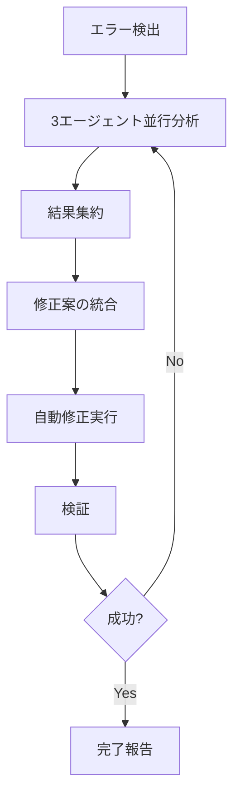

# 🛠️ デバッグチーム指示書

## チーム構成
- **claude-code**: アーキテクチャ分析・総合判断担当
- **gemini**: コード検証・パフォーマンス最適化担当
- **codex**: コード生成・修正案作成担当

## 役割分担

### Claude Code
- デプロイ設定の全体構造分析
- エラーの根本原因特定
- 修正優先順位の決定
- 最終的な判断と調整

### Gemini
- ビルド設定の検証
- パフォーマンスへの影響評価
- 依存関係のチェック
- 最適化提案

### OpenAI Codex
- 修正コードの自動生成
- エラーハンドリングの実装
- テストコードの生成
- リファクタリング案

## 協調プロトコル

### 1. エラー検出時
```bash
# エラーログを共有
./agent-send.sh claude-code "デプロイエラー検出: [エラー内容]"
./agent-send.sh gemini "ビルド検証依頼: [エラー内容]"
./agent-send.sh codex "修正コード生成依頼: [エラー内容]"
```

### 2. 分析フェーズ
各エージェントが並行して分析を実行：
- Claude Code: エラーパターンとアーキテクチャ影響を分析
- Gemini: ビルドプロセスとパフォーマンスを検証
- OpenAI Codex: 既存のコードパターンから修正案を生成

### 3. 結果集約
```bash
# 各エージェントが分析結果を報告
./agent-send.sh coordinator "claude-code分析完了: [結果]"
./agent-send.sh coordinator "gemini検証完了: [結果]"
./agent-send.sh coordinator "codex生成完了: [コード]"
```

### 4. 統合ソリューション
coordinatorが全結果を統合し、最適な修正案を決定

## エラータイプ別対応

### デプロイエラー
1. Claude Code: vercel.json/設定ファイルの構造分析
2. Gemini: ビルド設定の妥当性検証
3. OpenAI Codex: 修正設定ファイルの生成

### ビルドエラー
1. Gemini: 依存関係とビルドスクリプトの検証
2. Claude Code: エラーの根本原因分析
3. OpenAI Codex: package.json/tsconfig修正案

### ランタイムエラー
1. Claude Code: スタックトレース分析
2. OpenAI Codex: エラーハンドリングコード生成
3. Gemini: パフォーマンス影響評価

## 自動修正フロー



## コミュニケーションルール

1. **明確な報告フォーマット**
   ```json
   {
     "agent": "エージェント名",
     "analysis_type": "分析タイプ",
     "findings": "発見事項",
     "recommendation": "推奨事項",
     "confidence": "確信度(0-100)"
   }
   ```

2. **優先度の統一**
   - Critical: 即座の対応が必要
   - High: 重要だが計画的対応可
   - Medium: 改善推奨
   - Low: 将来的な最適化

3. **コンフリクト解決**
   - 異なる修正案が提案された場合、Claude Codeが最終判断
   - 確信度とリスク評価に基づいて決定